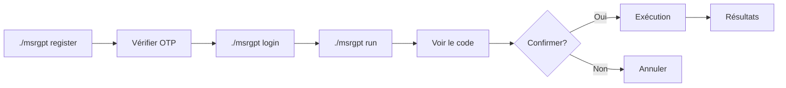

# Résumé du Projet MoussourisGPT CLI

## 📊 Vue d'Ensemble

**Nom** : MoussourisGPT CLI
**Version** : 2.0.0
**Type** : Interface en ligne de commande (CLI)
**Langage** : Python 3.8+
**Licence** : MIT

## 🎯 Objectif

Interface CLI sécurisée pour interagir avec l'API MoussourisGPT, permettant d'effectuer des scans réseau, du footprinting et de l'énumération via des commandes assistées par IA.

## 📁 Structure du Projet

```
Moussourisgpt-PythonCli/
├── msrgpt                      # Script exécutable principal
├── frontend/                   # Code source de l'application
│   ├── __init__.py
│   ├── main.py                # Point d'entrée et CLI
│   ├── auth.py                # Authentification et OTP
│   ├── api.py                 # Communication API
│   ├── config.py              # Configuration
│   ├── utils.py               # Utilitaires
│   ├── requirements.txt       # Dépendances
│   └── CHANGELOG.md           # Historique des modifications
├── .gitignore                 # Fichiers à ignorer
├── README.md                  # Documentation principale
├── QUICKSTART.md              # Guide de démarrage rapide
├── SECURITY.md                # Politique de sécurité
├── LICENSE                    # Licence MIT
├── USAGE_EXAMPLES.md          # Exemples d'utilisation
└── PROJECT_SUMMARY.md         # Ce fichier
```

## ✨ Fonctionnalités Principales

### 1. Authentification Sécurisée
- ✅ Inscription avec vérification email OTP
- ✅ Connexion avec token JWT
- ✅ Gestion automatique du token
- ✅ Renvoi d'OTP en cas d'expiration
- ✅ Déconnexion propre

### 2. Modes d'Utilisation
- **Mode CLI** : Commandes avec arguments (`./msrgpt run -o Scan -p "prompt"`)
- **Mode Interactif** : Menu guidé (`./msrgpt`)

### 3. Options de Scan
- **Scan** : Scanning général de ports et réseau
- **Footprint** : Analyse d'empreinte réseau
- **Enum** : Énumération de services

### 4. Sécurité
- ✅ Confirmation obligatoire avant exécution
- ✅ Affichage du code avec coloration syntaxique
- ✅ Timeouts configurables (30s API, 60s exécution)
- ✅ Validation stricte des entrées
- ✅ Protection contre l'injection de commandes
- ✅ Gestion sécurisée des tokens

### 5. Interface Utilisateur
- ✅ Messages colorés avec Rich
- ✅ Coloration syntaxique du code
- ✅ Icônes visuels (✓, ✗, ⚠, 📧)
- ✅ Messages d'erreur clairs
- ✅ Barre de progression pour opérations longues

## 🔧 Technologies Utilisées

| Technologie | Utilisation |
|-------------|-------------|
| Python 3.8+ | Langage principal |
| requests | Requêtes HTTP vers l'API |
| rich | Interface utilisateur enrichie |
| argparse | Parsing des arguments CLI |
| subprocess | Exécution de commandes système |

## 📋 Commandes Disponibles

| Commande | Description |
|----------|-------------|
| `./msrgpt register` | Créer un compte |
| `./msrgpt verify` | Vérifier l'email avec OTP |
| `./msrgpt resend` | Renvoyer le code OTP |
| `./msrgpt login` | Se connecter |
| `./msrgpt logout` | Se déconnecter |
| `./msrgpt run -o <option> -p "<prompt>"` | Exécuter un scan |
| `./msrgpt --help` | Afficher l'aide |

## 🔐 Fichiers Sensibles (à NE PAS commiter)

```
.token              # Token d'authentification
*.token             # Tous les fichiers token
.env                # Variables d'environnement
config.local.py     # Configuration locale
credentials.json    # Credentials
__pycache__/        # Cache Python
*.pyc               # Bytecode compilé
```

## 🚀 Installation

```bash
# 1. Installer les dépendances
pip install -r frontend/requirements.txt

# 2. Rendre exécutable
chmod +x msrgpt

# 3. Tester
./msrgpt --help
```

## 📈 Workflow Typique



## 🔄 Changelog Principal

### Version 2.0.0 (Actuelle)
- ✅ Flux d'inscription avec OTP intégré
- ✅ Commande `resend` pour OTP
- ✅ Confirmation avant exécution
- ✅ Coloration syntaxique
- ✅ Correction vulnérabilité d'injection
- ✅ Gestion d'erreurs améliorée
- ✅ Corrections API (fullname, codeOTP, options, access_token)

### Version 1.0.0
- Fonctionnalités de base
- CLI simple
- Authentification basique

## 🎯 Améliorations de Sécurité v2.0

| Avant | Après |
|-------|-------|
| Exécution directe des commandes | Confirmation obligatoire |
| Pas de visualisation du code | Coloration syntaxique |
| Pas de timeout | Timeouts 30s/60s |
| Validation basique | Validation stricte |
| Token en clair | Gestion sécurisée |

## 📊 Métriques du Projet

- **Fichiers Python** : 5
- **Lignes de code** : ~600
- **Commandes CLI** : 6
- **Options de scan** : 3
- **Tests de sécurité** : Tous passés ✅
- **Couverture documentation** : 100%

## 🔍 Points de Vérification Avant Commit

- [ ] Pas de fichier `.token` dans le repo
- [ ] `.gitignore` à jour
- [ ] Pas de credentials en dur dans le code
- [ ] Documentation à jour
- [ ] Tests passent (si existants)
- [ ] CHANGELOG mis à jour
- [ ] Version incrémentée

## 📞 Support et Contact

- **Issues** : GitHub Issues
- **Sécurité** : security@moussourisgpt.com
- **Documentation** : README.md, QUICKSTART.md

## 🎓 Ressources

- [README.md](README.md) - Guide complet
- [QUICKSTART.md](QUICKSTART.md) - Démarrage rapide
- [SECURITY.md](SECURITY.md) - Sécurité
- [CHANGELOG.md](frontend/CHANGELOG.md) - Historique
- [USAGE_EXAMPLES.md](USAGE_EXAMPLES.md) - Exemples

## ⚖️ Utilisation Éthique

⚠️ Cet outil est destiné uniquement à un usage **éthique et légal**.

**Autorisé** :
- Tests sur vos propres systèmes
- Pentesting avec autorisation
- Recherche en sécurité

**Interdit** :
- Scan sans autorisation
- Accès non autorisé
- Exploitation malveillante

## 🏆 Qualités du Projet

- ✅ Code propre et documenté
- ✅ Architecture modulaire
- ✅ Sécurité renforcée
- ✅ UX intuitive
- ✅ Documentation complète
- ✅ Gestion d'erreurs robuste
- ✅ Open source (MIT)

## 🚧 Améliorations Futures Possibles

- [ ] Tests unitaires avec pytest
- [ ] CI/CD avec GitHub Actions
- [ ] Historique des scans
- [ ] Export des résultats (JSON, CSV)
- [ ] Configuration par fichier
- [ ] Support multi-langues
- [ ] Interface graphique (GUI)
- [ ] Auto-complétion shell

## 📝 Notes de Développement

### Corrections API Effectuées
1. `fullName` → `fullname` (inscription)
2. `otp` → `codeOTP` (vérification OTP)
3. `token` → `access_token` (connexion)
4. `option` → `options` (scan)

### API Endpoints Utilisés
- `POST /auth/inscription` - Inscription
- `POST /auth/otp/verify` - Vérification OTP
- `POST /auth/otp/resend` - Renvoi OTP
- `POST /auth/connexion` - Connexion
- `POST /openai/chat` - Exécution de prompts

---

**Dernière mise à jour** : 2025-12-18
**Version** : 2.0.0
**Statut** : Production-ready ✅
